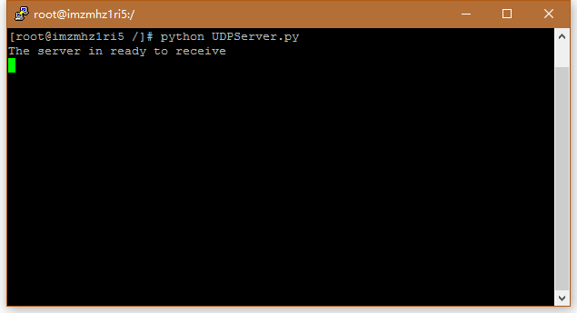
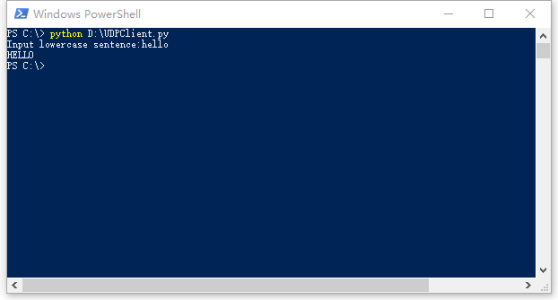
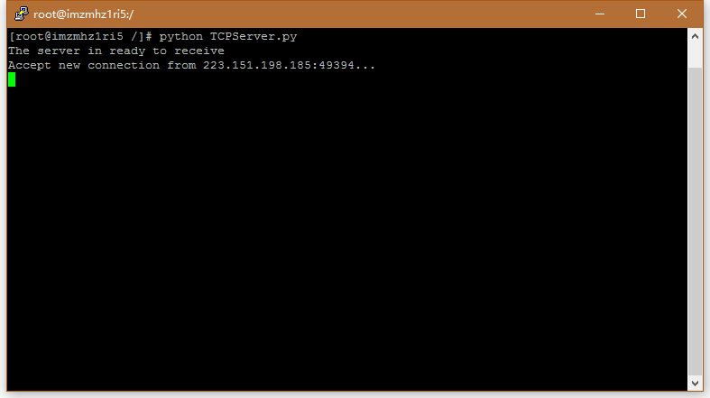
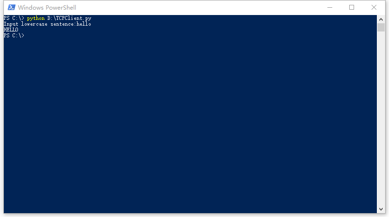

# TCP套接字编程/UDP套接字编程：生成网络应用

## UDP套接字编程

### 1. 描述
《自顶向下方法（原书第7版）》第2.7.1节给出了一个使用Python的UDP套接字编程实例，实现了一个简单的UDP通信程序。

### 2. 代码

客户端程序`UDPClient.py`创建一个UDP套接字，并在用户输入一段小写字母组成的字符串后，发送到指定服务器地址和对应端口，等待服务器返回消息后，将消息显示出来。

服务端程序`TCPServer.py`一直保持一个可连接的UDP套接字，在接收到字符串后，将其改为大写，然后向客户端返回修改后的字符串。 

1. [UDPClient.py](UDPClient.py)
```python
'''UDPClient.py'''

from socket import *

serverName = input('Please enter the hostname of server: ') # 提供服务器的地址或主机名的字符串（若使用主机名将自动执行DNS lookup得到IP地址）。
serverPort = 12000 # 指定服务器端口

# 创建UDP套接字。
# 第一个参数使用地址簇，特别地，AF_INET指示底层网络使用IPv4协议；
# 第二个参数指示变量是一个UDP套接字。
clientSocket = socket(AF_INET, SOCK_DGRAM) 

message = input('Input lowercase sentence:') # 用户输入信息

# 通过该套接字向目的主机发送报文
# 先用encode()方式将字符串转换为字节类型
clientSocket.sendto(message.encode(), (serverName, serverPort)) 

# 当分组到达套接字时，数据存放在modifiedMessage中，源地址存放在serverAddress中
modifiedMessage, serverAddress = clientSocket.recvfrom(2048) # 设置缓存长度为2048

print(modifiedMessage.decode()) # 显示服务器返回的信息

clientSocket.close() # 关闭套接字，然后关闭该进程
```

2. [UDPServer.py](UDPServer.py)
```python
'''UDPServer.py'''

from socket import *

serverPort = 12000 # 服务器指定的端口
serverSocket = socket(AF_INET, SOCK_DGRAM) # 创建UDP套接字

# 将端口与该服务器的端口绑定
# 以这种方式，当向该服务器的IP地址的12000号端口发送分组时，该分组将导向该套接字
serverSocket.bind(('', serverPort))

print("The server in ready to receive")
while True: # 服务器将无限期接收UDP报文并处理来自客户端的分组
	message, clientAddress = serverSocket.recvfrom(2048) # 接收客户端信息，同时获得客户端地址
	modifiedMessage = message.decode().upper() # 将客户端发来的字节解码为字符串后变为大写
	serverSocket.sendto(modifiedMessage.encode(), clientAddress) # 通过已经获得的客户端地址，将修改后的信息发回客户端
```

### 3. 运行

先在一台机器上启动服务器程序，然后在另一台机器上启动客户端程序。运行效果如下：

服务器端：



客户端：



- - -

## TCP套接字编程

### 1. 描述

《自顶向下方法（原书第7版）》第2.7.2节给出了一个使用Python的TCP套接字编程实例。实现了一个简单的TCP通信程序。

### 2. 代码

客户端程序`TCPClient.py`创建一个TCP套接字，然后向指定服务器地址和端口发起连接，等待服务器连接后，再将用户输入的字符串通过套接字发送，其后将服务器返回的消息显示出来。

服务端程序`TCPServer.py`一直保持一个TCP欢迎套接字，可接收任何客户端的连接请求。在接收到客户端的连接请求后，创建一个新的TCP连接套接字用于单独与该客户通信，同时显示客户端地址和端口。在接收到客户端发来的字符串后，将其改为大写，然后向客户端返回修改后的字符串。最后，关闭TCP连接套接字。

1. [TCPClient.py](TCPClient.py)

```python
'''TCPClient.py'''

from socket import *

serverName = input('Please enter the hostname of server: ') # 提供服务器的地址或主机名的字符串
serverPort = 12000 # 指定服务器端口

# 建立客户端的套接字。
# 第二个参数SOCK_STREAM表明是TCP类型的套接字。
# 创建客户端套接字时不用指定端口号，操作系统会进行分配
clientSocket = socket(AF_INET, SOCK_STREAM) 

clientSocket.connect((serverName, serverPort)) # 客户端向服务器发起连接，执行三次握手，建立起TCP连接

sentence = input('Input lowercase sentence: ') # 用户在客户端中输入信息

# 将信息发送到服务器
# 与UDP连接不同的是，TCP socket并不显式地创建一个分组并附上目的地址，而只是将分组放入TCP连接中
clientSocket.send(sentence.encode())

modifiedSentence = clientSocket.recvfrom(2048) # 从服务器接收信息

print('From server: ', modifiedSentence[0].decode()) # 显示信息

clientSocket.close() # 关闭套接字，因此关闭客户端和服务器之间的TCP连接
```

2. [TCPServer.py](TCPServer.py)

```python
'''TCPServer.py'''

from socket import *

serverPort = 12000

serverSocket = socket(AF_INET, SOCK_STREAM) # 创建TCP欢迎套接字
serverSocket.bind(('',serverPort)) # 将服务器端口号serverPort与该套接字绑定起来
serverSocket.listen(10) # 服务器聆听来自客户端的TCP连接请求。最大连接数设置为10
print("The server in ready to receive")

while True:
	connectionSocket, addr = serverSocket.accept() # 接收到客户连接请求后，调用accept函数建立新的TCP连接套接字
	
	sentence = connectionSocket.recv(2048).decode() # 获取客户发送的字符串
	capitalizedSentence = sentence.upper() # 将字符串改为大写
	connectionSocket.send(capitalizedSentence.encode()) # 向用户发送修改后的字符串
	connectionSocket.close() # 关闭TCP连接套接字
```

### 3. 运行

先在一台机器上启动服务器程序，然后在另一台机器上启动客户端程序。运行效果如下：

服务器端:



客户端：

