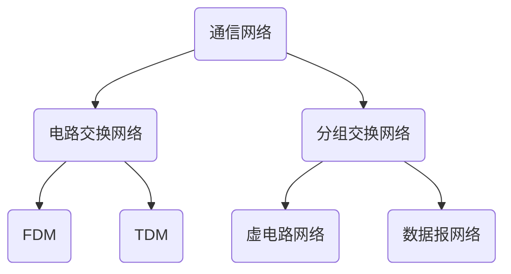

# 计算机网络——自顶向下方法 7th

中国科学技术大学 郑烇教授 2020年秋季 自动化系

## 1. 计算机网络概述

了解基本术语和概念；掌握网络的基本原理；方法：以Internet为例

### 1.1 什么是Internet?

- 网络：电话网、蜘蛛网、神经元网络等
    - 节点和边的关系，与大小形状无关
- 计算机网络：联网的计算机构成的系统
    - 节点：
        - 主机节点（数据的源、目标）：Web服务器、手机、电脑、联网的冰箱等 主机及其上运行的应用程序
        - 数据交换节点（不是源、目标，转发数据的中转节点）：路由器（网络层）、交换机（链路层）等 网络交换设备
    - 链路（连接节点，构成网络的边），分为两类：
        - 接入网链路：主机通过以太网的网线接入最近的交换机，连接到互联网
        - 主干链路：路由器之间的链路
    - 协议：支撑互联网工作的重要标准，网络设备遵守协议进行交互；不同层有不同的协议，每一层有多个协议
- 互联网：以TCP协议和IP协议为主的一簇协议支撑起工作的网络


什么是Internet：1. 从具体构成角度
- 数以亿计的、互联的计算设备: 
  - 主机 = 端系统(host、end_system)
  - 运行网络应用程序
- 通信链路
  - 光纤、同轴电缆、无线电、卫星
  - 传输速率 = 带宽(比特/秒：bit/s or bps)
- 分组交换设备：转发分组(packets)
  - 路由器和交换机
- 协议控制发送、接收消息
  - 如TCP、IP、HTTP、FTP、PPP
- Internet：“网络的网络”
  - 松散的层次结构，互连的ISP
  - 公共Internet vs. 专用intranet
- Internet标准
  - RFC: Request for comments 请求评述
  - IETF: Internet Engineering Task Force 所有协议都以RFC文档形式在IETF上发布

什么是协议？

- 人类协议：“几点了？”、“我有个问题”、你好 
    - ...发送特定的消息
    - ...收到消息时采取的特定行动或其他事件
- 网络协议：
    - 类似人类协议
    - 机器之间的协议而非人与人之间的协议
    - Internet中所有的通信行为都受协议制约

协议定义了在两个或多个通信实体之间交换的**报文格式**和**次序**，以及在报文传输和/或接收或其他事件方面所采取的**动作**。

报文格式：语法和语义 【PDU（协议数据单元）】；
次序（时序）；
动作：收到报文后做出的内部处理的动作


什么是Internet：2. 从服务角度

分布式应用进程以及为分布式应用进程提供通信服务的基础设施

基础设施包括：主机应用层以下的所有运行中的协议实体、目标主机应用层以下的所有运行中的协议实体、所有的网络部分

- 使用通信设施进行通信的分布式应用
    - Web、VoIP、email、分布式游戏、电子商务、社交网络......
- 通信基础设施为apps提供编程接口（通信服务）
    - 将发送和接收数据的apps与互联网连接起来
    - 为app应用提供服务选择，类似于邮政服务：
        - 无连接不可靠服务 —— UDP协议
        - 面向连接的可靠服务 —— TCP/IP协议

### 1.2 网络边缘

网络结构：
- 网络边缘(edge)：
    - 主机
    - 应用程序（客户端和服务器）
- 网络核心(core)：数据交换作用
    - 互连着的路由器
    - 网络的网络
- 接入网、物理媒体(access)：将边缘的端系统（主机）接入到核心，使任意两个端系统可以通信
    - 有线或者无线通信链路

网络边缘：
- 端系统（主机）：
    - 运行应用程序
    - 如Web、email
    - 在“网络的边缘”
- 客户端(Client)/服务器(Server)模式(C/S模式)：主-从模式，存在可扩展性的问题
    - 客户端向服务器请求、接收服务，通常是桌面PC、移动PC和智能手机等
    - 服务器是更为强大的机器，用于存储和发布Web页面、流视频、中继电子邮件等，大部分都属于大型数据中心
    - 如Web浏览器/服务器；email客户端/服务器
- 对等(peer-peer)模式：每个节点既是客户端，又是服务器，通讯是分布式的
    - 很少（甚至没有）专门的服务器
    - 如Gnutella、KaZaA、Emule电驴、迅雷等分布式文件分发系统

基础设施为网络应用提供的服务又有两种方式：

1.网络边缘：采用网络设施的面向连接服务：先建立连接，做好准备，两个应用进程再通信
- 目标：在端系统之间传输数据
    - 握手：在数据传输之前做好准备
        - 人类协议中：你好、你好
        - 两个通信主机之间为连接建立状态
    - TCP——传输控制协议(Transmission Control Protocol)
        - Internet上面向连接的服务
- TCP服务[RFC 793]
    - 可靠地、按顺序地传送数据：不重复、不丢失、不失序
        - 确认和重传
    - 流量控制（考虑接收方的处理能力）
        - 发送方不会淹没接收方，协调发送/接受速度，实现有序通信
    - 拥塞控制（考虑网络路径的通行能力）
        - 当网络拥塞时，发送方降低发送速率

<span id="Jump1"></span>
*注：面向连接和有连接有区别：*
*面向连接：通信状态只在端系统中维护，网络不知道*
*有连接：中间的所有节点都知道*
[点击返回“数据报与虚电路”](#JumpBack1)

2.网络边缘：采用基础设施的无连接服务：不用先握手
- 目标：在端系统之间传输数据
    - 无连接服务
- UDP——用户数据报协议(User Datagram Protocol)[RFC 768]：将主机-主机通过UDP端口细分到进程-进程；速度快，适合于实时多媒体应用
    - 无连接
    - 不可靠数据传输
    - 无流量控制、无拥塞控制：发送速度等于接收速度
- 使用TCP的应用：对于可靠性要求较高
    - HTTP(Web)，FTP(文件传送)，Telnet(远程登录)，SMTP(email)
- 使用UDP的应用：
    - 流媒体、远程会议、DNS、Internet电话、一些事物性应用（如域名解析等）

### 1.3 网络核心

网络核心：路由器的网状网络

作用：数据交换

基本问题：数据怎样通过网络进行传输？
- 电路交换(circuit switching)：为每个呼叫预留一条专有电路：如电话网
- 分组交换(packet switching)：互联网和几乎所有计算机网络都运用分组交换；以分组为单位，存储转发
    - 将要传送的数据分成一个个单位：分组
    - 将分组从一个路由器传到相邻路由器(hop)，一段段最终从源端传到目标端
    - 每段：采用链路的最大传输能力（带宽）

网络核心：电路交换

首先通过**信令系统**，在网络核心中为两者之间的通信分配一条独享的线路。
交换节点和交换节点之间的链路较粗，带宽较大，可以采用时分多路复用、频分多路复用、码分多路复用（多用于接入网）、波分多路复用（多用于光纤（光通信））等多种方法分解成小片(pieces)。
通过信令系统，可以挑出每两个节点之间当前没有用的片，串在一起，形成两台主机之间的独享线路

端到端的资源被分配给从源端到目标端的呼叫“call”：
- 图中，每段链路有4条线路：
    - 该呼叫采用了上面链路的第2个线路，右边链路的第1个线路(piece)
- 独享资源：不同享
    - 每个呼叫一旦建立起来就能够保证性能
- 如果呼叫没有数据发送，被分配的资源就会被浪费(no sharing)
- 通常被传统电话网络采用


为呼叫预留端-端资源
- 链路带宽、交换能力
- 专用资源：不共享
- 保证性能
- 要求建立呼叫连接

网络资源（如带宽）被分成片
- 为呼叫分配片
- 如果某个呼叫没有数据，则其资源片处于空闲状态（不共享）
- 将带宽分成片，怎么分？
    - 频分(Frequency-division multiplexing)：将可用通讯频率覆盖范围分为多个频段
    - 时分(Time-division multiplexing)：将节点和节点之间的通信能力按时间分为T为单位的周期，每个T中分为若干小片，每个周期的第i片被第i个用户所使用
    - 波分(Wave-division multiplexing)：采用光电路，将可用波段分为若干个小的波段，每个用户使用其中一个小波段

频分FDM与时分TDM


> 计算举例：
> 
> 在一个电路交换网络上，从主机$A$到主机$B$发送一个$640,000$比特的文件需要多长时间？
> 其中：
> 所有的链路速率为$1.536Mbps$； 
> 每条链路使用时隙数为$24$的TDM； 
> 建立端-端的电路需$500ms$
> 
> 解：
> 每条链路的速率（一个时间片）：$1.536Mbps/24=64kbps$； 
> 传输时间：$640kb/64kps=10s$； 
> 共用时间：传输时间+建立链路时间=$10s$+$500ms$=$10.5s$
> 
> *注：此处未考虑传播延迟：相隔距离/光速；在局域网下，传播延迟可忽略不计，广域网的情况则不可以*

电路交换不适合计算机之间的通信
- 连接建立时间长
- 计算机之间的通信有突发性，如果使用线路交换/电路交换，则浪费的片较多
    - 即使这个呼叫没有数据传递，其所占据的片也不能够被别的呼叫使用
- 可靠性不高？

网络核心：分组交换

以分组为单位存储-转发方式
- 网络带宽资源不再分分为一个个片，传输时使用**全部带宽**
- 主机之间传输的数据被分为一个个单位，这个单位叫**分组**(packet)

资源共享，按需使用：
- 存储-转发：分组每次移动一跳(hop)
- 在转发之前，节点必须收到整个分组
- 延迟比线路交换要大
- 排队时间

1.分组交换：存储-转发

- 被传输到下一个链路之前，以分组为单位，整个分组必须到达路由器并存储下来：存储-转发的方式
- 在一个速率为$R(bps)$的链路，一个长度为$L(bits)$的分组的存储转发延时为$L/R(s)$

> Example:
> 
> $L=7.5Mbits$； 
> $R=1.5Mbps$； 
> 则$3$次存储转发的延时=$3L/R$=$15s$
> 
> *注：发送/接收是一件事情的两个方面，只能算一次，也可以认为发送/接收是同时进行的。*

若不采用存储-转发的方式，没有将整个分组先存储下来再转发，就会占用整个链路，该链路就不能用于其他主机对之间的通信，而变为独享；而存储-转发的方式决定了当前链路在被使用时，下一条链路可以被另外一个主机对使用。

电路交换中每个交换节点只耽误1个比特的时间，分组交换在每个交换节点耽误的时间为整个分组的存储时间，所以延迟更高，但是换取共享性。
此外，若当前节点正在存储或转发其他信息，则又会有排队时延。

2.分组交换: 排队延迟和丢失

排队和延迟：
- 如果到达速率>链路的输出速率（相当于总体上为净流入）:
    - 分组将会排队，等待传输
    - 端口的输出队列可能是一个有限值，如果路由器的缓存用完了，分组将会被抛弃(drop)

网络核心的关键功能
- 路由：决定分组采用的源到目标的路径；全局的
    - 路由算法
- 转发：局部的；通过查询路由表（由路由器/路由软件/路由模块计算得出），决定从一个端口传过来的内容存储之后通过哪条链路转发到另外一个端口
    - 将分组从路由器的输入链路转移到输出链路

分组交换：统计多路复用

A&B 时分复用 链路资源

A & B 虽然仍采用划分时间片的方式，但是分组没有固定的模式，即不一定每个周期的第i片被第i个用户所使用-->统计多路复用

结论：
分组交换 vs. 电路交换：
1. 分组交换允许更多的用户使用网络

> Example：
> 
> $1Mb/s$链路；$N$个用户
> 
> 每个用户：
> 活动时$100kb/s$； 
> $10\%$的时间是活动的
> 
> 则：
> 1. 电路交换能支持多少用户？$1_{(Mb/s)}/100_{(kb/s)}=10$用户
> 2. 假设$N=35$，若采用分组交换：$35$用户时，$>=10$个用户活动的概率为$0.0004$
> $$1-\sum_{n=0}^{9}\begin{pmatrix}35\\n\end{pmatrix}p^n(1-p)^{35-n}$$
> 说明$99.96\%$的情况下每个时刻有少于$10$个用户在活动，此时没有超出链路带宽，说明分组交换模式能够很好地支持$35$个用户，而电路交换最多只能支持$10$个。

2. 分组交换是“突发数据的胜利者？”
- 适合于对**突发式数据**传输
    - 资源共享而非独享
    - 简单，不必建立呼叫
- 过度使用会造成**网络拥塞**：分组延时和丢失
    - 对可靠地数据传输需要协议来约束：拥塞控制
- Q:怎样提供类似电路交换的服务？
    - 保证音频/视频应用需要的带宽
    - 一个仍未解决的问题(chapter7)

分组交换网络：存储-转发
- 分组交换: 分组的存储转发一段一段从源端传到目标端，按照有无网络层的连接，分成：
1. **数据报网络**：不用先建立连接；交换节点中不用维护通信状态（无状态路由器）；每个分组都携带目标主机的完整地址；每个分组传送都是独立的
   - 分组的目标地址决定下一跳
   - 在不同的阶段，路由可以改变
   - 类似：问路，寄信
   - Internet
2. **虚电路网络**：主机和目标主机通信前先握手，在交换节点之间建立一条虚拟线路（通过信令建立），每个分组携带一条虚电路号而非目标主机的完整地址进行标识；中间的路由器维护通信状态（有连接）（<span id="JumpBack1"></span>*注：分清楚有连接、面向连接和无连接*[点击跳转](#Jump1)）连接称为网络层的连接
   - 每个分组都带标签（虚电路标识 VC ID），标签决定下一跳
   - 在呼叫建立时决定路径，在整个呼叫中路径保持不变
   - 路由器维持每个呼叫的状态信息
   - X.25和ATM

数据报(datagram)的工作原理：
- 在通信之前，无须建立起一个连接，有数据就传输
- 每一个分组都独立路由（有可能走不同路径，可能会失序）
- 路由器根据分组的目标地址进行路由

虚电路(virtual circuit)的工作原理


如图，A的表象分为两块：输入部分和输出部分。输入部分分为两块：来自于哪里，第几号虚电路；输出部分也分为两块：往哪里走（如图中即为往B走还是往E走），第几号虚电路。

总结：网络分类


### 1.4 接入网和物理媒体

*注：核心网（骨干网）中也有物理媒体*

怎样将端系统和边缘路由器连接？
住宅接入网络；
单位接入网络（学校、公司）；
无线接入网络（局域/广域）

重要指标：接入网的带宽(bits per second)；共享/专用

住宅接入：**modem调制解调器**
- 将上网数据调制加载音频信号上，在电话线上传输，在局端将其中的数据解调出来；反之亦然
    - 调频
    - 调幅
    - 调相位
    - 综合调制
- 拨号调制解调器
    - 带宽窄：$56Kbps$的速率直接接入路由器（通常更低）
    - 不能同时上网和打电话：不能总是在线

目前该方式（电话拨号上网）已经基本被淘汰，目前主要使用**接入网**(digital subscriber line，缩写DSL)的方式其采取如下方式：
$4Khz$以下用于语音通信，$4Khz$以上按照非对称的方式，一段用于上行，一段用于下行，用于下行的带宽更大，上下行数据仍然按照调制解调的方式工作。
可行的原因：电话线离最近的交换机较近，线路质量较好，$4Khz$以下有保障，且$4Khz$以上又有可以挖掘的资源。


- 采用现存的到交换局DSLAM的电话线
    - DSL线路上的数据被传到互联网
    - DSL线路上的语音被传到电话网
- 上行传输速率小于$2.5Mbps$（通常小于$1Mbps$）
- 下行传输速率小于$24Mbps$（通常小于$10Mbps$）

若上下行带宽的划分为非对称的，又称为ADSL。

这保证了上网和打电话同时的可行性。

还有一种方式为**线缆网络**。


将有线电视信号线缆数字化双向改造（对应了上文中的电话线）

FDM：在不同频段传输不同信道的数据，数字电视（和数字广播）和上网数据（上下行），上行带宽是多用户共享，下行的带宽是头端通过互联网往下面发送
- HFC：hybrid fiber coax
    - 非对称：最高$30Mbps$的下行传输速率，$2Mbps$上行传输
速率
- 线缆和光纤网络将个家庭用户接入到ISP路由器
- 各用户共享到线缆头端的接入网络
    - 与DSL不同，DSL每个用户一个专用线路到CO(central office)

除了电信运营商、有线电视公司运营商，电力公司的线缆资源也可以被应用于上网。

电缆模式：光纤+同轴电缆

近些年光纤到户的方式逐渐流行开来。

**无线接入网络**
- 各无线端系统共享无线接入网络（端系统到无线路由器）
    - 通过基站或者叫接入点
- 无线LANs：
    - 建筑物内部(100 ft)
    - 802.11b/g (WiFi)：11， 54Mbps传输速率
- 广域无线接入
    - 由电信运营商提供(cellular)，10’s km
    - 1到10Mbps 
    - 3G，4G：LTE

物理媒体
- Bit：在发送-接收对间传播
- 物理链路：连接每个发送-接收对之间的物理媒体
- 导引型媒体：有形介质
    - 信号沿着固体媒介被导引：同轴电缆、光纤、 双绞线
- 非导引型媒体：无形介质
    - 开放的空间传输电磁波或者光信号，在电磁或者光信号中承载数字数据

常见的导引型媒体：
- 双绞线 (TP)
    - 两根绝缘铜导线拧合
    - 5类：100Mbps以太网，Gbps千兆位以太网
    - 6类：10Gbps万兆以太网
- 同轴电缆：
    - 两根同轴的铜导线
    - 双向
    - 基带电缆：
        - 电缆上一个单个信道
        - Ethernet
    - 宽带电缆：同时有多个频段在工作，对应窄带电缆（细缆）只有一个频段在工作
        - 电缆上有多个信道
        - HFC
- 光纤和光缆：
    - 光脉冲，每个脉冲表示一个bit，在玻璃纤维中传输
    - 高速：
        - 点到点的高速传输（如10Gps-100Gbps传输速率）
    - 低误码率：在两个中继器之间可以有很长的距离，不受电磁噪声的干扰
    - 安全

常见的非导引型电缆（无线链路）：
- 开放空间传输电磁波，携带要传输的数据
- 无需物理“线缆”
- 双向
- 传播环境效应：
    - 反射
    - 吸收
    - 干扰
- 无线链路类型:
    - 地面微波
        - e.g. up to 45 Mbps channels
    - LAN (e.g., WiFi)
        - 11Mbps, 54 Mbps, 540Mbps...
    - wide-area (e.g., 蜂窝)
        - 3G cellular: ~ few Mbps
        - 4G 10Mbps
        - 5G few Gbps
    - 卫星
        - 每个信道Kbps到45Mbps（或者多个聚集信道）
        - 270 msec端到端延迟
        - 同步静止卫星和低轨卫星

### 1.5 Internet结构和ISP

前面的Internet结构划分是按照节点和链路的类型来划分（边缘、核心和接入网），现在采用一种不同的划分方式，将一些关系较密集的、处于同一网络的设备称之为一个ISP的网络，互联网由很多个ISP的网络构成，通过网络互联设备连接在一起。

互联网络结构：网络的网络
- 端系统通过接入**ISPs**(Internet Service Providers)连接到互联网：如手机通过移动/联通这个ISP接入互联网
    - 住宅，公司和大学的ISPs
- 接入ISPs相应的必须是互联的
    - 因此任何2个端系统可相互发送分组到对方
- 导致的“网络的网络”非常复杂
    - 发展和演化是通过经济的和国家的政策来驱动的
- 让我们采用渐进方法来描述当前互联网的结构

问题：给定数百万接入ISPs，如何将它们互联到一起？

将每两个ISPs直接相连，不可扩展，需要$O(N^2)$连接

另一个选项: 将每个接入ISP都连接到全局ISP（全局范围内覆盖）？
客户ISPs和提供者ISPs有经济合约
- 竞争：但如果全局ISP是有利可为的业务，那会有竞争者
- 合作：通过ISP之间的合作可以完成业务的扩展，肯定会有互联，对等互联的结算关系

...然后业务会细分（全球接入和区域接入），区域网络将出现，用与将接入ISPs连接到全局ISPs。

然后内容提供商网络(Internet Content Providers,e.g., Google, Microsoft, Akamai)可能会构建它们自己的网络，将它们的服务、内容更加靠近端用户，向用户提供更好的服务,减少自己的运营支出

最终：
在网络的最中心，一些为数不多的充分连接的大范围网络（分布广、节点有限、 但是之间有着多重连接） 
- “tier-1” commercial ISPs (e.g., Level 3, Sprint, AT&T, NTT)，国家或者国际范围的覆盖 
- content provider network (e.g., Google)：将它们的数据中心接入ISP，方便周边用户的访问；通常私有网络之间用专网绕过第一层ISP和区域

松散的层次模型
- 中心：第一层ISP（如UUNet, BBN/Genuity, Sprint, AT&T）国家/国际覆盖，速率极高，部署的点少
    - 直接与其他第一层ISP相连
    - 与大量的第二层ISP和其他客户网络相连（PoP）
- 第二层ISP：更小些的（通常是区域性的）ISP
    - 与一个或多个第一层ISPs，也可能与其他第二层ISP
- 第三层ISP与其他本地ISP(local ISP)
    - 接入网（与端系统最近）

一个分组要经过许多网络！

很多内容提供商(如：Google, Akamai)可能会部署自己的网络，连接自己的在各地的DC（数据中心），走自己的数据

连接若干local ISP和各级（包括一层）ISP，更加靠近用户

经济考虑：少付费；用户体验考虑：更快

ISP之间的连接：
- POP: 高层ISP面向客户网络的接入点，涉及费用结算 
    - 如一个低层ISP接入多个高层ISP，多宿（multi home） 
- 对等接入：2个ISP对等互接，不涉及费用结算 
- IXP：多个对等ISP互联互通之处，通常不涉及费用结算 
    - 对等接入 
- ICP(Internet Content Provider, 互联网内容提供商)自己部署专用网络，同时和各级ISP连接

### 1.6 分组延时、丢失和吞吐量

相比较于电路交换，分组交换有更多的延时以及可能的丢失。

分组丢失和延时是怎样发生的？

在路由器缓冲区的分组队列发生**延时**：
- 分组到达链路的速率超过了链路输出的能力
- 分组等待排到队头、被传输

可用的缓冲区：分组到达时，如果没有可用的缓冲区，则该分组被丢掉（分组**丢失**）。
*注：分组直接丢失而非扩大缓冲区存储更多分组：若队列过长，则传输延时过长，此时与其保证信息完整，不如直接丢弃*

四种分组延时
1. 节点处理延时：
- 检查bit级差错
- 检查分组首部和决定将分组导向何处
2. 排队延时
- 在输出链路上等待传输的时间
- 依赖于路由器的拥塞程度，时长随机
3. 传输延时：打出分组（L个比特）所需要的时间
- $R=$链路带宽$(bps)$
- $L=$分组长度$(bits)$
- 将分组发送到链路上的时间$=L/R$
- 存储转发延时
4. 传播延时：1跳/段(hop)的时间
- $d=$物理链路的长度
- $s=$在媒体上的传播速度（~$2*10^8m/s$）
- 传播延时$=d/s$

> 车队类比：
> 
> 汽车以$100km/h$的速度传播；
> 收费站服务每辆车需$12s$（传输时间）
>     
>   汽车-bit；车队-分组
> 
> Q：在车队在第二个收费站排列好之前需要多长时间？即从车队的第一辆车到达第一个收费站开始计时，到这个车队的最后一辆车离开第二个收费站，共需要多少时间？
> 
> A：
> 将车队从收费站输送到公路上的时间 $=12*10=120s$（传输延时）；
> 
> 最后一辆车从第一个收费站到第二个收费站的传播时间：$100km/(100km/h)=1h$（传播延时）；
> 
> 总共 $1h+120s=62minutes$
> 
> 汽车以$1000km/h$的速度传播汽车；收费站服务每辆车需$1$分钟
> 
> Q：在所有的汽车被第一个收费站服务之前，汽车会到达第二个收费站吗？
> 
> Yes！$7$分钟后，第一辆汽车到达了第二个收费站，而第一个收费站仍有3辆汽车
> 
> 在整个分组被第一个路由器传输之前，第一个比特已经到达了第二个路由器！
> 
> *注：对比以上两种情况，第一种的**信道容量**大，可以传很多分组，而第一种甚至传不完一个分组；第一种类比WAN的情况，第二种类比LAN的情况*

节点延时
$$
d_{nodal} = d_{proc} + d_{queue} + d_{trans} + d_{prop}
$$
- $d_{proc}=$ 处理延时：通常是微秒数量级或更少
- $d_{queue}=$ 排队延时：取决于拥塞程度，随机的
- $d_{trans}=$ 传输延时：$=L/R$，对低速率的链路而言很大（如拨号），通常为微秒级到毫秒级
- $d_{prop}=$ 传播延时：几微秒到几百毫秒

排队延时取决于流量强度：

- 定义：
    R=链路带宽(bps)；
    L=分组长度(bits)；
    a=分组到达队列的平均速率（单位时间到达的分组数量）
- 流量强度(Intensity)=La/R，量纲为1，值为0~1
    - La/R ~ 0：平均排队延时很小
    - La/R -> 1：延时变得很大
    - La/R > 1：比特到达队列的速率超过了从该队列输出的速率，平均排队延时将趋向无穷大！
- 设计系统时流量强度不能大于1！

> Internet的延时和路由可以通过TraceRoute诊断程序查看。
> 
> 命令行中输入：
> ```shell
> tracert <hostname>   # <hostname>为目标域名或网址
> ```
> 
> *注：更完整的命令如下：*
> ```shell
> tracert [-d] [-h maximum_hops] [-j computer-list] [-w timeout] target_name 
> ```
> 
> 详见帮助：[http://www.linkwan.com/gb/broadmeter/article/trace-help.htm](http://www.linkwan.com/gb/broadmeter/article/trace-help.htm)
> 
> TraceRoute诊断程序：提供从源端，经过路由器，到目的的延时测量
> - For all i:
>     - 沿着目的的路径，向每个路由器发送3个探测分组
>     - 路由器 i 将向发送方返回一个分组
>     - 发送方对发送和回复之间间隔计时
> 
> TraceRoute采用互联网控制报文协议(ICMP)。分组的IP头部的生存时间(time to live, TTL)字段每经过一个路由节点时TTL减少1，当TTL减为0时分组被抛掉，此时抛掉分组的路由节点向源主机发送ICMP的控制报文，源主机此时记录时间即得到分组延时(Round Trip Time, RTT)。源主机故意将到达目标主机后的端口设置为不存在，故到达目标主机后，由于目标端口不存在，则目标主机将分组抛弃。

分组丢失：
- 链路的队列缓冲区容量有限
- 当分组到达一个满的队列时，该分组将会丢失
- 丢失的分组可能会被前一个节点（若链路本身可靠）或源端系统（若链路本身不可靠）重传，或根本不重传（若采用UDP协议等）

吞吐量：在源端和目标端之间传输的速率（（有效）数据量/单位时间）
- 瞬间吞吐量:在一个时间点的速率
- 平均吞吐量:在一个长时间内平均值

瓶颈链路：端到端路径上，限制端到端吞吐的链路（若一个链路有$n$个连接共享使用，由TCP协议的公平性，每个连接享受该链路带宽的$1/n$。*注：虽然分组交换使用统计多路复用，但是长时间看带宽还是平均分配的。即非一个周期内的平均，而是长时间下统计意义上的平均*）

端到端平均吞吐（符合短桶效应）：
$$R=min(R_1, R_2, ... , R_n)$$

## 1.7 协议层次和服务模型

协议层次
- 网络功能繁杂：数字信号的物理信号承载、点到点、路由、rdt、进程区分、应用等
- 现实来看，网络的许多构成元素和设备：主机；路由器；各种媒体的链路；应用；协议；硬件，软件
- 问题是：如何组织和实现这个复杂的网络功能？

层次化方式实现复杂网络功能！
- 将网络复杂的功能分层功能明确的层次，每一层实现了其中一个或一组功能，功能中有其上层可以使用的功能：服务（功能的子集）
- 本层协议实体相互交互执行本层的协议动作，目的是实现本层功能，通过接口为上层提供更好的服务
- 在实现本层协议的时候，直接利用了下层所提供的服务
- 本层的服务：借助下层服务实现的本层协议实体之间交互带来的新功能（上层可以利用的）+ 更下层所提供的服务

服务：
1. 服务和服务访问点
- 服务(Service)：低层实体向上层实体提供它们之间的通信的能力
    - 服务用户(service user)：如TCP实体上的多个应用
    - 服务提供者(service provider)：如TCP实体
- 原语(primitive)：上层使用下层服务的形式，高层使用低层提供的服务，以及低层向高层提供服务都是通过服务访问原语来进行交互的---形式
- 服务访问点SAP(Services Access Point)：上层使用下层提供的服务通过层间的接口—地点；
    - 例子：邮箱
    - 地址(address)：下层的一个实体支撑着上层的多个实体，SAP有标志、区分不同上层实体（服务用户）的作用
    - 可以有不同的实现，队列
    - 例子：传输层的SAP：端口(port)
2. 服务的类型
- 面向连接的服务和无连接的服务-方式
    - 面向连接的服务(Connection-oriented Service)
        - 连接(Connection)：两个通信实体为进行通信而建立的一种结合
        - 面向连接的服务通信的过程：建立连接，通信，拆除连接
        - 面向连接的服务的例子：网络层的连接被成为虚电路
        - 适用范围：对于大的数据块要传输；不适合小的零星报文
        - 特点：保序
        - 服务类型：
            - 可靠的信息流 传送页面（可靠的获得，通过接收方的确认）
            - 可靠的字节流 远程登录
            - 不可靠的连接 数字化声音
    - 无连接的服务(Connectionless Service)
    - 无连接服务：两个对等层实体在通信前不需要建立一个连接，不预留资源；不需要通信双方都是活跃；（例：寄信）
        - 特点：不可靠、可能重复、可能失序
        - IP分组，数据包；
        - 适用范围：适合传送零星数据；
        - 服务类型：
            - 不可靠的数据报 电子方式的函件
            - 有确认的数据报 挂号信
            - 请求回答 信息查询
3. 服务和协议
- 服务与协议的区别
    - 服务(Service)：低层实体向上层实体提供它们之间的通信的能力，是通过原语(primitive)来操作的，垂直
    - 协议(protocol)：对等层实体(peer entity)之间在相互通信的过程中，需要遵循的规则的集合，水平
- 服务与协议的联系
    - 本层协议的实现要靠下层提供的服务来实现
    - 本层实体通过协议为上层提供更高级的服务

数据单元(DU)


第n层是当前层，n+1层是用户，n-1层是服务提供者。
n+1层将服务数据单元(SDU)传给第n层，接口控制信息(ICI)用于将数据穿过层间接口，ICI和SDU打包为IDU一起传输。在穿过层间接口后，ICI就没用了，将SDU加上本层的一些交换信息在第n层头部(n-header)形成第n层PDU(n-PDU)，第n层的PDU再作为第n-1层的IDU进行层间传输。**上层的PDU对于本层是SDU，封装后对于本层是PDU。**

当SDU较大时，在穿过层间接口时，就将SDU分为小块，每个小块加上第n层的头部形成合适大小的第n层的PDU，一一对应。
当SDU非常小时，在穿过层间接口时，将若干个SDU合在一起，再加上第n层的头部信息形成第n层的PDU。

<span id="JumpBack2"></span>
每一层的协议数据单元(PDU)都有特定的称呼。应用层的数据单元称为应用报文；传输层的称为报文段（TCP协议）/数据段（UDP协议），简称为段；网络层的通常称为分组，若网络是无连接方式工作，又称为数据报；链路层的称为帧(frame)；物理层的称为位/比特……（[参考跳转](#Jump2)）

分层处理和实现复杂系统的好处
- 概念化：结构清晰，便于标示网络组件，以及描述其相互关系
    - 分层参考模型
- 结构化：模块化更易于维护和系统升级
    - 改变某一层服务的实现不影响系统中的其他层次
        - 对于其他层次而言是透明的
            - 如改变登机程序并不影响系统的其它部分
                - 改变2个秘书使用的通信方式不影响2个翻译的工作
                - 改变2个翻译使用的语言也不影响上下2个层次的工作
- 分层思想被认为有害的地方？子系统之间交换信息效率低等等

Internet协议栈：应用层——传输层——网络层——链路层——物理层
- 应用层：网络应用
    - 为人类用户或者其他应用进程提供网络应用服务
    - FTP，SMTP，HTTP，DNS
- 传输层：主机之间的数据传输
    - 在网络层提供的端到端通信基础上，细分为进程到进程；TCP将IP提供的不可靠的通信变成可靠地通信
    - TCP，UDP
- 网络层：为数据报从源到目的选择路由
    - 主机主机之间的通信，端到端通信，不可靠
    - IP，路由协议
- 链路层：相邻网络节点间的数据传输（从比特流确定一帧的开始和结束，以帧为单位进行传输）
    - 相邻两点的通信，点到点通信，可靠或不可靠
    - 点对点协议PPP，802.11(wifi)，Ethernet
- 物理层：在线路上传送bit

ISO/OSI参考模型：应用层——表示层——会话层——传输层——网络层——链路层——物理层
- 表示层：允许应用解释传输的数据，e.g.，加密，压缩，机器相关的表示转换，应用层就只用关心语义上的信息，在TCP/IP协议栈中通过应用层自己实现。
- 会话层：数据交换的同步，检查点，恢复
- 互联网协议栈没有这两层！
    - 这些服务，如果需要的话，必须被应用实现

封装和解封装


链路层交换机主要用于组建局域网，而路由器则主要负责连接外网并寻找网络中最合适数据传输的路径。
最后需要说明的是：路由器一般都具有防火墙功能，能够对一些网络数据包选择性的进行过滤。现在的一些路由器都具备交换机的功能，也有具备路由器功能的交换机，称为三层交换机。相比较而言，路由器的功能较交换机要强大，但是速度也相对较慢，价格较为昂贵，而三层交换机既有交换机的线性转发报文的能力，又有路由器的路由功能，因此得到了广泛的应用。

<span id="Jump2"></span>
各层次的协议数据单元(PDU)[参考对应上文](#JumpBack2)
- 应用层：报文(message)
- 传输层：报文段(segment)：TCP段，UDP数据报
- 网络层：分组packet（如果无连接方式：数据报datagram）
- 数据链路层：帧(frame)
- 物理层：位(bit)

### 1.8 Internet历史


1. 早期（1960以前）计算机网络
- 线路交换网络
- 线路交换的特性使得其不适合计算机之间的通信
    - 线路建立时间过长
    - 独享方式占用通信资源，不适合突发性很强的计算机之间的通信
    - 可靠性不高，一个节点损毁影响整条链路：非常不适合军事通信
- 三个小组独立地开展分组交换的研究
    - 1961: Kleinrock(MIT)，排队论，展现了分组交换的有效性
    - 1964: Baran(美国兰德公司) – 军用网络上的分组交换
    - 1964：Donald（英国）等，NPL

2. 1961-1972：早期的分组交换概念
- 1967：美国高级研究计划研究局考虑ARPAnet
    - Kleinrock在MIT的同事
- 1969：第一个 ARPAnet节点开始工作，UCLA
    - IMP：接口报文处理机
    - 1969年底：4个节点
- 1972：
    - ARPAnet公众演示
    - 网络控制协议是第一个端系统直接的主机-主机协议
        - NCP协议：相当于传输层和网络层在一起，支持应用开发
    - 第一个e-mail程序（BBN）
    - ARPAnet有15个节点
3. 1972-1980：专用网络和网络互联
- 出现了很多对以后来说重要的网络形式，雨后春笋
    - 1970：ALOHAnet,夏威夷上的微波网络
    - 1973：Metcalfe在博士论文中提出了Ethernet
    - ATM网络
        - ALOHAnet，Telenet，Cyclades法国等
- 1970后期，网络体系结构的必要性
    - 专用的体系结构：DECnet，SNA，XNA
    - 标准化的体系结构
- 1974：网际互联的Cerf and Kahn体系结构
- 1979：ARPAnet的规模在持续增加，体系结构也在酝酿着变化，以支持网络互联和其他目的（性能）需求
    - 节点数目增加，有200个节点

*注：*
*Cerf and Kahn网络互联原则定义了今天的Internet体系结构：*
*1.极简、自治*
*2.尽力而为(best effort)服务模型*
*3.无状态的路由器*
*4.分布控制*

4. 1980-1990：体系结构变化，网络数量激增，应用丰富
- 1983：TCP/IP部署，标记日
    - NCP分化成2个层次，TCP/IP，从而出现UDP
    - 覆盖式IP解决网络互联问题
    - 主机设备和网络交换设备分开
- 1982：smtp e-mail协议定义
- 1983：DNS定义，完成域名到IP地址的转换
- 1985：ftp 协议定义
- 1988：TCP拥塞控制
- 其他网络形式的发展
    - 新的国家级网络：Csnet，BITnet，NSFnet，Minitel
    - 1985年：ISO/OSI提出，时机不对且太繁琐，
- 100,000主机连接到网络联邦

5. 1990，2000’s：商业化，Web，新的应用
- 1990年代初：NSF对ARPAnet的访问网，双主干，ARPAnet退役
- 1991：NSF放宽了对NSFnet用于商业目的的限制（1995退役），ASFNET非盈利性机构维护，后面叫Internet
- UNIX中TCP/IP的免费捆绑
- 1990年代初：Web
    - hypertext [Bush 1945, Nelson 1960’s]
    - HTML, HTTP: Berners-Lee
    - 1994: Mosaic (Netscape，andreesen)
    - 1990年代后期：Web的商业化
- 1990后期 – 21世纪：
    - TCP/IP体系结构的包容性，在其上部署应用便捷，出现非常多的应用
    - 新一代杀手级应用（即时讯息，P2P文件共享，社交网络等）更进一步促进互联网的发展
    - 安全问题不断出现和修订（互联网的补丁对策）
    - 2001网络泡沫，使得一些好公司沉淀下来（谷歌，微软，苹果，Yahoo，思科）
    - 主干网的速率达到Gbps

6. 2005-现在
- ~50+亿主机：包括智能手机和平板
- 宽带接入的快速部署
- 高速无线接入无处不在：移动互联时代
    - 4G部署，5G蓄势待发
    - 带宽大，终端性能高，价格便宜，应用不断增多
- 在线社交网络等新型应用的出现: 
    - Facebook：10亿用户
    - 微信，qq：数十亿用户
- 内容提供商 (Google, Microsoft)创建他们自己的网络
    - 通过自己的专用网络提供对搜索、视频内容和电子邮件的即刻访问
- 电子商务，大学，企业在云中运行他们的服务（eg, Amazon EC2）
- 体系结构酝酿着大的变化，未来网络蠢蠢欲动

### 1.9 小结

1. Internet
2. 什么是协议
3. 网络边缘，核心，接入网络
    - 分组交换 vs. 电路交换
4. Internet/ISP 结构
5. 性能: 丢失，延时，吞吐量
6. 层次模型和服务模型
7. 历史

- 组成角度看 什么是互联网
    - 边缘：端系统（包括应用） + 接入网
    - 核心：网络交换设备 + 通信链路
    - 协议：对等层实体通信过程中遵守的规则的集合
        - 语法，语义，时序
- 为了实现复杂的网络功能，采用分层方式设计、实现和调试
    - 应用层，传输层，网络层，数据链路层，物理层
    - 协议数据单位：
        - 报文，报文段，分组，帧，位
- 从服务角度看互联网
    - 通信服务基础设施
        - 提供的通信服务：面向连接 无连接
    - 应用
- 应用之间的交互
    - C/S模式
    - P2P模式
- 数据交换
    - 分组数据交换
    - 线路交换
- 比较 线路交换和分组交换
- 分组交换的2种方式
    - 虚电路
    - 数据报
- 接入网和物理媒介
    - 接入网技术：
        - 住宅：ADSL，拨号，cable modem
        - 单位：以太网
        - 无线接入方式
    - 物理媒介
        - 光纤，同轴电缆，以太网，双绞线
- ISP层次结构
- 分组交换网络中延迟和丢失是如何发生的
    - 延迟的组成：处理、传输、传播、排队
- 网络的分层体系结构
    - 分层体系结构
    - 服务
    - 协议数据单元
    - 封装与解封装
- 历史
