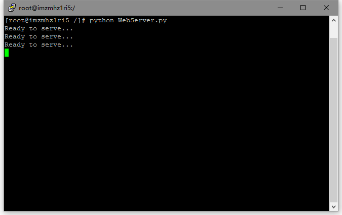
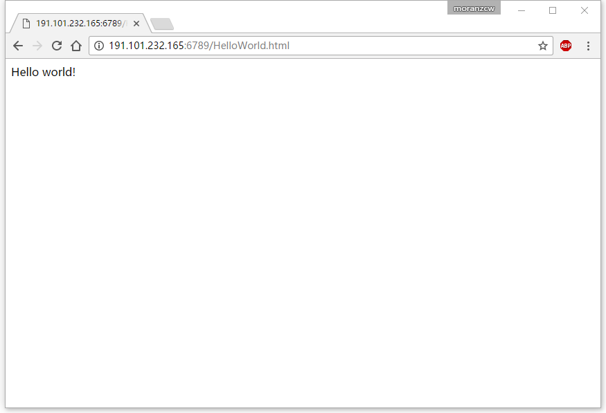
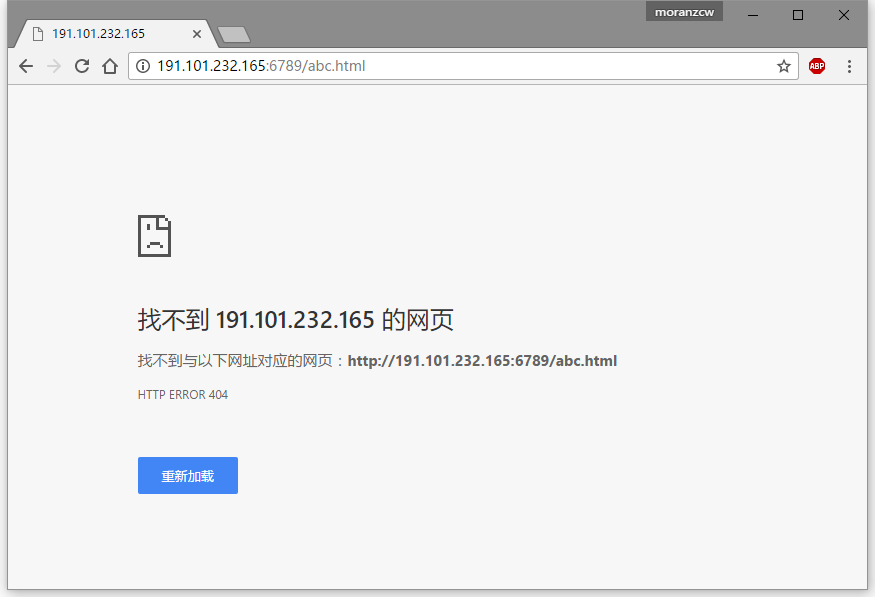

# Solution of Assignment_1：Web Server

## 作业描述

《计算机网络：自顶向下方法》中第二章末尾给出了此编程作业的简单描述：

> 在这个编程作业中，你将用Python语言开发一个简单的Web服务器，它仅能处理一个请求。具体而言，你的Web服务器将：
> 1. 当一个客户（浏览器）联系时创建一个连接套接字；
> 2. 从这个连接套接字接收HTTP请求；
> 3. 解释该请求以确定所请求的特定文件；
> 4. 从服务器的文件系统获得请求的文件；
> 5. 创建一个由请求的文件组成的HTTP响应报文，报文前面有首部行；
> 6. 经TCP连接向请求浏览器发送响应。如果浏览器请求一个在该服务器种不存在的文件，服务器应当返回一个“404 Not Found”差错报文。  
>
> 在配套网站中，我们提供了用于该服务器的框架代码，我们提供了用于该服务器的框架代码。你的任务是完善该代码，运行服务器，通过在不同主机上运行的浏览器发送请求来测试该服务器。如果运行你服务器的主机上已经有一个Web服务器在运行，你应当为该服务器使用一个不同于80端口的其他端口。

## 详细描述

官方文档：[Socket1_WebServer.pdf](Socket1_WebServer.pdf)

翻译：[Translations_Programming_Assignment_1.md](Translations_Programming_Assignment_1.md)

## 实现

建立一个只允许一个连接的服务器，在指定端口监听客户端的请求，从客户端发送的请求中提取文件名，若该文件存在于服务器上（如下文的"HelloWorld.html"），则生成一个状态码200的POST报文，并返回该文件；若该文件不存在，则返回一个404 Not Found报文。

## 代码

详见：

[WebServer.py](WebServer.py)

[HelloWorld.html](HelloWorld.html)

## 运行

服务器端：

在一台主机上的同一目录下放入`WebServer.py`和`HelloWorld.html`两个文件，并运行`WebServer.py`，作为服务器。

客户端：

在另一台主机上打开浏览器，并输入"http://XXX.XXX.XXX.XXX:6789/HelloWorld.html" （其中"XXX.XXX.XXX.XXX"是服务器IP地址），以获取服务器上的`HelloWorld.html`文件。

一切正常的话，可以看到如下页面：

输入新地址"http://XXX.XXX.XXX.XXX:6789/abc.html"，以获取服务器上不存在的`abc.html`。

将出现以下页面（注意页面中的"HTTP ERROR 404"）：

