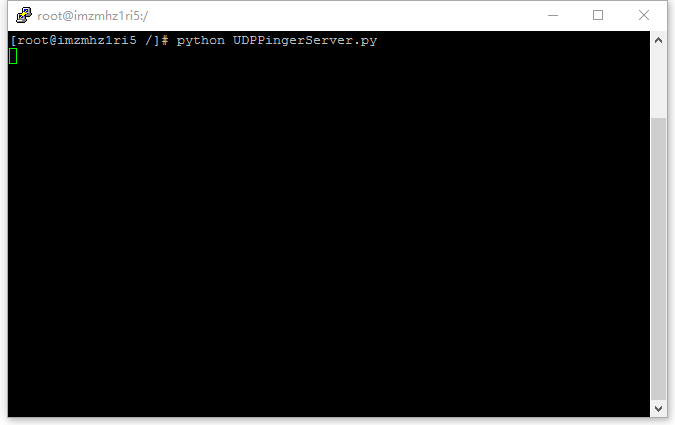
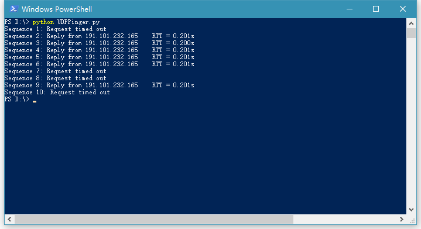

# Solution of Assignment_2：UDPping

## 作业描述

《计算机网络：自顶向下方法》中第二章末尾给出了此编程作业的简单描述：

> 在这个编程作业中，你将用Python编写一个客户ping程序。该客户将发送一个简单的ping报文，接受一个从服务器返回的pong报文，并确定从该客户发送ping报文到接收到pong报文为止的时延。该时延称为往返时延（RTT）。由该客户和服务器提供的功能类似于在现代操作系统中可用的标准ping程序，然而，标准的ping使用互联网控制报文协议（ICMP）（我们将在第4章中学习ICMP）。此时我们将创建一个非标准（但简单）的基于UDP的ping程序。
>
> 你的ping程序经UDP向目标服务器发送10个ping报文，对于每个报文，当对应的pong报文返回时，你的客户要确定和打印RTT。因为UDP是一个不可靠协议，由客户发送的分组可能会丢失。为此，客户不能无限期地等待对ping报文的回答。客户等待服务器回答的时间至多为1秒；如果没有收到回答，客户假定该分组丢失并相应地打印一条报文。
>
> 在此作业中，我们给出服务器的完整代码（在配套网站中可以找到。你的任务是编写客户代码，该代码与服务器代码非常类似。建议你先仔细学习服务器的代码，然后编写你的客户代码，可以不受限制地从服务器代码中剪贴代码行。

## 详细描述

官方文档：[Socket2_UDPpinger.pdf](Socket2_UDPpinger.pdf)

翻译：[Translations_Programming_Assignment_2.md](Translations_Programming_Assignment_2.md)

## 实现

读懂文档给出的Ping程序服务器端代码后，可以很容易的写出Ping程序。首先建立一个UDP套接字，并指定目的IP地址和端口。随之使用一个循环来发送数据包，共循环10次。其中每次在发送前从系统提取一次时间，接收到服务器返回的消息后 ，再提取一次时间，两次相减，即可得到每个消息的往返时延（RTT）。

## 代码

[UDPPingerServer.py](UDPPingerServer.py)

[UDP_Pinger_Client.py](UDP_Pinger_Client.py)

## 运行

服务器端：

在一台主机上运行`UDPPingerServer.py`，作为接收ping程序数据的服务器。

效果如下：

**客户端：**

在另一台主机上运行`UDP_Pinger_Client.py`，效果如下：

