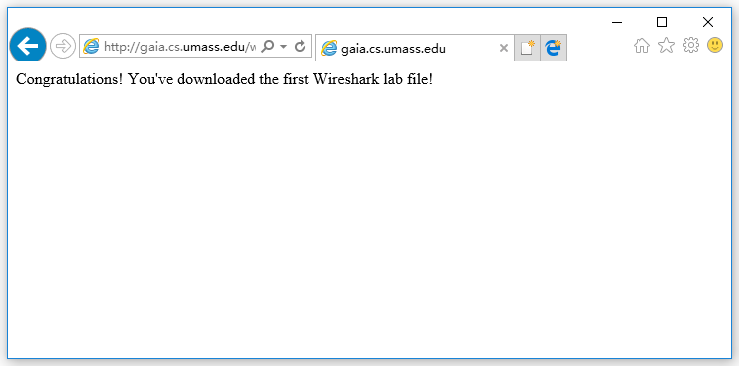
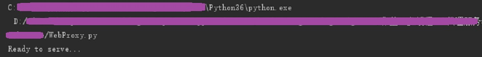
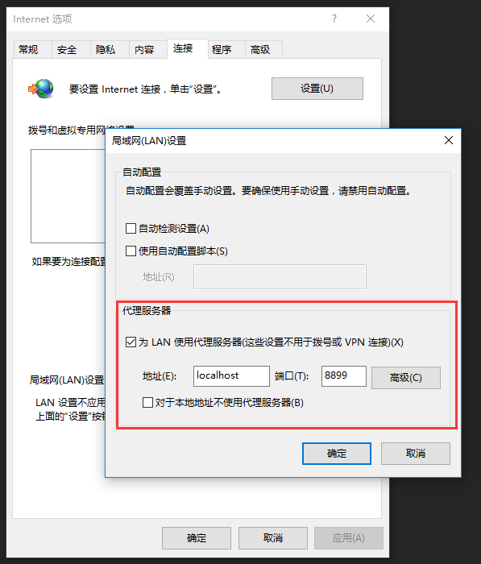
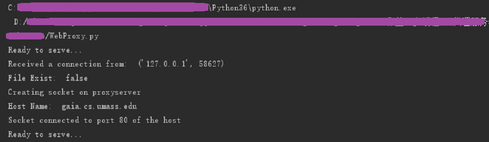
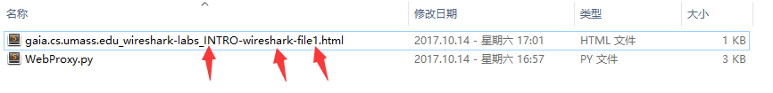
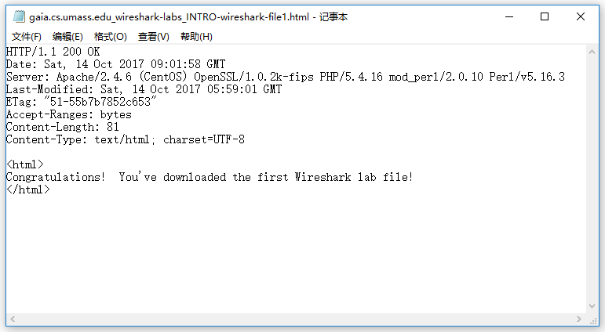
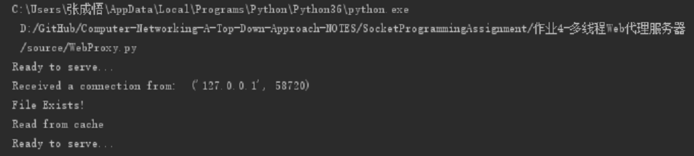

# Solution of Assignment_4：ProxyServer

## 作业描述

《计算机网络：自顶向下方法》中第二章末尾给出了此编程作业的简单描述：

> 在这个编程作业中，你将研发一个简单的Web代理服务器。当你的代理服务器从一个浏览器收到某对象的HTTP请求，它生成对相同对象的一个新HTTP请求并向初始服务器发送。当该代理从初始服务器接收到具有该对象的HTTP响应时，它生成一个包括该对象的新HTTP响应，并发送给该客户。这个代理将是多线程的，使其在相同时间能够处理多个请求。
>
> 对本作业而言，配套Web网站对该代理服务器提供了框架代码。你的任务是完善该代码，然后测试你的代理，方式是让不同的浏览器经过你的代理来请求Web对象。

## 详细描述

官方文档：[Socket4_ProxyServer.pdf](Socket4_ProxyServer.pdf)

## 实现

书中的问题描述和官方文档描述略有区别，书中强调多线程的实现，官方文档强调缓存的实现，以官方文档为准。

按照官方文档的代码骨架，代理程序接收用户的GET请求，若请求的内容发已存在于代理服务器，则直接返回内容，若不存在，则转发该请求到目标服务器，接收目标服务器的响应，并将响应内容存储为文件，作为缓存，已被之后同样的请求。

## 代码文件

[ProxyServer.py](ProxyServer.py)

## 运行

我们使用链接 http://gaia.cs.umass.edu/wireshark-labs/INTRO-wireshark-file1.html 测试我们的代理程序，该链接是本书第一个wireshark实验使用的测试连接，正常打开后会出现一条欢迎语句：

接着在本地运行代理服务器程序：

打开IE浏览器，并设置代理，指向我们自己编写的代理程序：

然后在IE浏览器中打开上文提到的链接，网页将正常显示：

这时代理服务器程序显示缓存中不存在该文件，转发请求并接收响应的消息：

同时在代理服务器程序的同目录下 会发现缓存的网页文件：

打开后的内容包含响应头和正文：

我们在浏览器中重新打开该链接，网页将正常显示，但是代理程序会显示缓存中已存在该网页，于是直接返回该文件：

